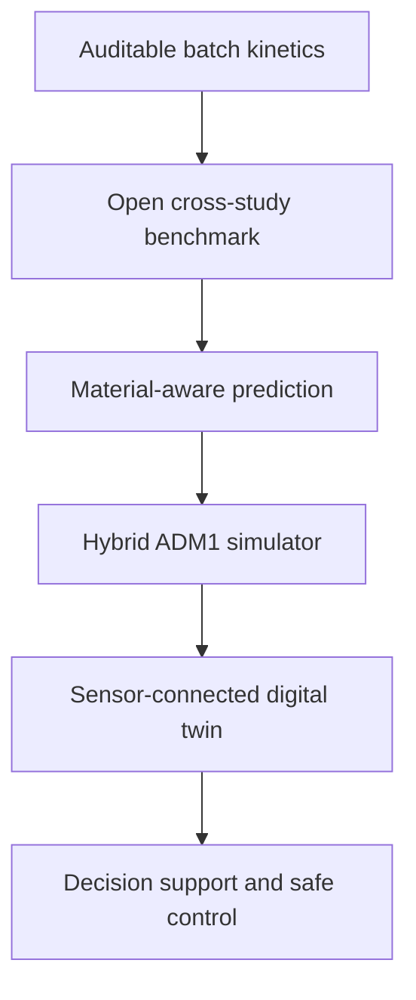

# Biochar–AD Kinetics

[](https://github.com/thisisnikan/Biochar-AD-Kinetics/actions)
[](https://www.python.org/)
[](LICENSE)
[](docs/PROJECT_STATUS.md)

An open, evidence-gated modelling project for testing when and under which
conditions biochar changes anaerobic-digestion performance. The current
software starts with the part that can be tested honestly today: reproducible
analysis of batch biomethane potential (BMP) experiments, including kinetic-model
comparison, uncertainty and leakage-safe validation.

**New to this project? Start with the map:** [Architecture and glossary](docs/ARCHITECTURE.md)
explains the idea, the repository layout and the code path in plain language.

**Then:** [Scientific status](docs/PROJECT_STATUS.md) ·
[Data contract](docs/DATA_CONTRACT.md) · [Data provenance](data/README.md) ·
[Mechanism-evidence grading](docs/MECHANISM_EVIDENCE.md) ·
[Reproducible results](results/README.md) ·
[Presentation](presentation/README.md) · [Contributing](CONTRIBUTING.md)

## The problem

Biochar-assisted anaerobic digestion has a translation problem, not just a curve-fitting
problem:

- Experimental evidence is fragmented across substrates, inocula, temperatures,
  biochar feedstocks, production conditions, doses and reporting conventions. Raw reactor
  trajectories, blanks and material descriptors are often unavailable or incompatible.
- A high score on pooled literature data can overstate generalisation. In a 623-condition,
  107-study analysis, random-forest R² fell from 0.683 under conventional validation to
  0.36 when entire studies were held out, exposing substantial study-to-study heterogeneity
  ([Huaraca et al., 2026](https://doi.org/10.1016/j.biortech.2026.135652)).
- Methane improvement alone cannot establish a mechanism. Conductivity, surface area, pH,
  pyrolysis temperature and feedstock can change together, so correlations must not be
  presented as proof of direct interspecies electron transfer or adsorption.
- A fitted batch curve is not yet a digital twin. Operational use would additionally require
  a dynamic process model, continuous-reactor data, sensors, state estimation, online
  calibration, uncertainty bounds and prospective plant validation.

The result is a gap between promising experiments and trustworthy decisions: researchers
cannot compare studies cleanly, operators cannot know whether a result will transfer, and
apparently precise models can hide data leakage or parameter confounding.

## How this project addresses it now

| Problem | Repository response | Evidence gate |
| --- | --- | --- |
| Incompatible or incomplete reactor data | A provenance-aware intake contract preserves reactor identity, blanks, controls, units, QC and raw/processed values | `validate-intake` must pass; source-level review is still required |
| One curve fit per treatment gives inconsistent comparisons | Shared kinetic candidates are evaluated on identical data and folds | Held-out error is primary; AIC/AICc/BIC are descriptive |
| Replicates can leak into an allegedly unseen dose | Reactor and dose generalisation are tested separately | `fit-stage-a` removes every sibling reactor at the held-out dose |
| Flexible models can look convincing while parameters remain confounded | Every global fit reports parameter correlation and the Gram-matrix condition number | A low-error but non-identifiable fit does not pass the scientific gate |
| Positive results are easier to publish than negative ones | Independent challenges and failed hypotheses remain visible | The log-quadratic dose response is reported as unsupported on the current external challenge |
| Process response can be mistaken for mechanism | Each dataset receives an explicit mechanism-evidence grade | Mechanistic language cannot exceed the measurements that support it |

**Current boundary.** This repository is a batch kinetic-modelling and statistical-
benchmarking framework. Its dose-response term is phenomenological: a falsifiable curve
shape, not a biological mechanism. It currently has no ADM1 mass balance, reactor
hydrodynamics, sensor connection or live data-assimilation loop.

## What this project can become

The long-term opportunity is a research-to-operations platform for biochar-assisted
anaerobic digestion. That future should be earned in stages, with every new capability
unlocked by stronger data rather than by a larger claim.



| Stage | What the project becomes | Minimum evidence required | Claim unlocked |
| --- | --- | --- | --- |
| 0 — current | Auditable batch-kinetics benchmark and contribution workflow | Traceable reactor trajectories, explicit blanks/controls and leakage-safe splits | Reproducible within-dataset kinetic comparison |
| 1 — open benchmark | FAIR, versioned multi-study data resource with common units, material metadata and benchmark tasks | Redistribution rights, DOI/source hashes, transformation logs and study-held-out evaluation | Reproducible comparison across published studies |
| 2 — material-aware predictor | Model linking dose and operating conditions with feedstock, pyrolysis temperature, BET area, conductivity, pH and surface chemistry | Sufficiently diverse studies; collinearity checks; calibrated uncertainty; external-study validation | Conditional prediction for unseen study/material combinations within a declared domain |
| 3 — hybrid process simulator | ADM1-based mass balances augmented by validated biochar effects or learned parameter mappings | Continuous-reactor measurements of gas, VFA, ammonia, pH and feed composition; mass-balance closure | Dynamic scenario testing, not merely cumulative-curve fitting |
| 4 — experiment and decision support | Uncertainty-aware comparison of material, dose and operating scenarios; active-learning suggestions for the next experiment; optional cost, energy and carbon objectives | Prospective tests showing recommendations outperform fixed or expert-only designs; validated economic and life-cycle inputs for non-process objectives | Multi-objective decision support with a stated applicability domain |
| 5 — operational digital twin | A live reactor counterpart combining sensor streams, delayed laboratory results, state estimation and online calibration | Timestamped plant data, fault handling, drift detection and prospective site validation | Monitored state estimation and forecasting for a specific plant |
| 6 — safe optimisation | Human-supervised model-predictive control for feed, loading or other permitted actions | Safety constraints, fail-safe modes, operator approval and controlled field trials | Operational optimisation at validated sites |

An API, dashboard and collaborative data portal can support every stage, but they are
delivery layers rather than substitutes for scientific validation.

### Roadmap: problem → evidence → capability

1. **Now — pass Stage A dose validation.** Acquire independent reactor-level trajectories
   at one digestion temperature, including a zero-dose control, at least three amended
   doses of the same material, intact replicates, blanks and provenance. Freeze QC and model
   comparisons before viewing held-out outcomes.
2. **Next — prove transfer across studies and materials.** Build a licensed, FAIR dataset;
   standardise units and metadata; establish simple baselines; and evaluate only with whole
   studies and whole material families held out.
3. **Then — add mechanism-compatible dynamics.** Introduce ADM1 or another mass-balanced
   process model, measure the states needed to identify biochar effects, and compare a
   mechanistic baseline with hybrid mechanistic–machine-learning alternatives.
4. **Later — connect a real reactor.** Ingest timestamped sensors and delayed laboratory
   measurements, estimate hidden states, quantify drift and uncertainty, and validate
   forecasts prospectively before any control recommendation is exposed.
5. **Finally — test decisions, not just predictions.** Evaluate experiment selection,
   operational recommendations and constrained control against predefined safety and
   performance criteria, with operators retaining authority.

### Research basis for this direction

- [ADM1](https://doi.org/10.2166/wst.2002.0292) provides the established biochemical and
  physicochemical modelling foundation for a future mass-balanced simulator.
- A [hybrid ADM1–machine-learning study](https://doi.org/10.1016/j.biombioe.2024.107176)
  demonstrates a credible route for predicting sensitive kinetic parameters from feedstock
  and operating information rather than replacing process structure with a black box.
- ADM1-based [state estimation on a full-scale biogas plant](https://doi.org/10.2166/wst.2012.174)
  and anaerobic-digestion [online soft sensors](https://doi.org/10.3390/pr8010067) show the
  additional measurement and estimation layers required before “digital twin” is an
  operational claim.
- Anaerobic-digestion [model-predictive-control research](https://doi.org/10.2166/wst.2025.151)
  motivates the final control stage, but only after plant-specific forecasting and safety
  validation.
- The [FAIR Guiding Principles](https://doi.org/10.1038/sdata.2016.18) motivate making the
  data, metadata, algorithms and workflows findable, accessible, interoperable and reusable.
- Evidence that anaerobic-digestion experiments need stronger standardisation
  ([Lavergne et al., 2018](https://doi.org/10.1016/j.jenvman.2018.05.030)) supports treating
  data quality and shared reporting as the first research infrastructure, not an afterthought.

## Current evidence at a glance

Outcome evidence (methane data that can support or challenge the model) and
metadata-only resources (data about materials or designs, with no methane
outcome) are kept in separate tables so the two are not read as equally strong.

**Outcome evidence:**

| Evidence layer | Dataset | What it supports | What it does not support |
| --- | --- | --- | --- |
| Software demonstration | Labelled synthetic BMP curves | End-to-end fitting, uncertainty and held-out-batch workflow | Scientific validation |
| Reactor-level benchmark | Kozłowski et al. (2025), 12 trajectories | Reproducible kinetic-family comparison | A universal biochar mechanism |
| Author-shared summary analysis | Zhang et al. (2022), treatment means and SDs | Kinetic/VFA analysis with explicit limitations | Replicate-held-out validation or new significance tests |
| Independent dose challenge | Valentin & Białowiec (2024), five fitted-dose endpoints | Falsifies the log-quadratic form as tested | Full reactor-trajectory validation |
| Published pyrolysis-temperature summary | CDU / Wang (2026) thesis, six biochars (400–900 °C) | Descriptive temperature-response check, with pyrolysis temperature/BET/conductivity/pH collinearity reported explicitly | Attributing any trend to one material property, a causal claim, or DIET evidence (see `docs/MECHANISM_EVIDENCE.md`) |
| Author-shared unpublished summary (private) | García-Prats et al., CYPRUS2025 extended abstract | Nine-biochar feedstock × pyrolysis-temperature dose-response dataset for private model testing | Public reproduction, peer review status, independent validation |

**Metadata-only resources (no methane outcome data):**

| Resource | Dataset | What it supports | What it does not support |
| --- | --- | --- | --- |
| Public design/material tables | García-Prats et al. (2024) | Tests metadata and material-aware structure | Any methane-outcome claim; not usable as evidence for or against the model |

**Literature context (not usable as data):**

| Evidence layer | Dataset | What it supports | What it does not support |
| --- | --- | --- | --- |
| Literature synthesis | Chiappero et al. (2022) meta-analysis | Motivates the non-monotonic dose-response functional form and gives a literature-derived optimal property range and dose-cost heuristic | Any reactor-level validation; it is aggregated meta-analysis output, not primary data |

The exact readiness assessment, limitations and next validation gate are maintained in
[`docs/PROJECT_STATUS.md`](docs/PROJECT_STATUS.md).

### Known statistical limitations (checked automatically, not hidden)

- **Parameter identifiability.** `fit_global` reports `max_parameter_correlation`
  and `parameter_gram_condition_number` for the 8-parameter global model. On
  the bundled synthetic demo dataset itself, two parameters are already
  confounded (correlation ≈ 0.96, above the 0.95 flag threshold) — no real
  dataset in this repository varies both dose and temperature with replicates,
  so the full parameter set has never been shown to be identifiable from real
  data. The CLI prints `identifiability_warning` whenever this threshold is
  crossed.
- **Interpolation vs. extrapolation.** `leave_one_batch_out` tags each held-out
  batch `is_boundary_condition`; only boundary rows say anything about
  extrapolation to untested conditions. `biochar-ad fit`/`demo` report
  interior and boundary held-out RMSE separately rather than one pooled mean.
- **Small-n effect sizes.** `summarize-effects` reports a 95% CI on every
  percent-change effect size (delta method on the log response ratio) and
  flags `low_replication` whenever a treatment or control arm has fewer than
  3 reactors, or whenever the underlying source is a published point estimate
  with no reported replicate spread at all (the Valentin & Białowiec table).
  Several of the larger reported percent changes have confidence intervals
  that cross zero.

## Research question and falsifiable hypothesis

**Question.** Does explicitly modelling biochar dose and temperature explain and
predict cumulative methane production better than a condition-agnostic kinetic
baseline?

**Hypothesis.** A shared dose–temperature model will improve held-out-batch
prediction and AICc relative to a three-parameter modified Gompertz curve. The
hypothesis is rejected if that gain disappears on independent experimental data.

This project connects chemical-engineering kinetics, anaerobic digestion and
scientific Python. It was designed by **Nikan Haghighatjue**, building on his MSc
research on biochar characterization for anaerobic digestion.

> **Scientific status:** the included dose-response layer remains an exploratory,
> testable modelling hypothesis. A separate, openly licensed experimental dataset
> is now included for kinetic-baseline benchmarking, but it has one temperature and
> one carbon-material dose. It therefore does **not** validate the global
> dose-temperature hypothesis.

## Current modelling workflow

Most BMP curves are fitted one at a time. That makes it difficult to compare
operating conditions consistently. This tool uses a shared parameter set and
represents biochar dose and temperature explicitly:

- modified Gompertz methane-production kinetics;
- smooth, non-monotonic biochar dose response;
- Q10 temperature correction for production rate;
- robust global least-squares estimation;
- parameter-identifiability diagnostics (correlation and condition number) reported
  alongside every fit, so a good RMSE is never mistaken for well-separated parameters;
- residual-bootstrap uncertainty that preserves batch structure, available for both
  the demo and real fits (`--bootstrap`);
- comparison of constant-Gompertz, log-linear and log-quadratic dose/temperature
  baselines on identical leave-one-batch-out folds, ranked by mean held-out RMSE
  (with descriptive training AIC, AICc and BIC);
- that held-out comparison also separates interior (interpolation) from boundary
  (extrapolation) error instead of pooling them;
- reproducible CSV, JSON and publication-ready PNG outputs.
- a minimum reactor-time-point data contract with automated intake validation.
- a direct Stage A path from that reactor-level contract to the kinetic model, with
  separate whole-reactor and whole-dose holdouts so dose replicates cannot leak into
  a nominally unseen-dose test.

## Model

For cumulative methane `M(t)`, the model uses:

```text
M(t) = P · exp{-exp[(e·R/P)(λ - t) + 1]}
```

`P` and `R` vary with `log(1 + dose)`, allowing both enhancement at moderate
dose and inhibition at excessive dose. Temperature changes `R` through a Q10
factor referenced to 37 °C. See `src/biochar_ad_kinetics/model.py` for the exact,
auditable implementation.

## Quick start

```bash
python -m venv .venv
source .venv/bin/activate  # Windows: .venv\Scripts\activate
pip install -e ".[dev]"
biochar-ad demo --output outputs --bootstrap 100
```

The command creates:

- `synthetic_bmp_data.csv` — explicitly labelled demonstration data;
- `fit_summary.json` — fitted parameters and diagnostic metrics, including
  `max_parameter_correlation` and `parameter_gram_condition_number`;
- `bootstrap_summary.csv` — uncertainty summary;
- `model_comparison.csv` — baseline comparison and ΔAICc;
- `leave_one_batch_out.csv` — prediction error for every model and held-out batch,
  tagged `is_boundary_condition` to separate interpolation from extrapolation;
- `held_out_model_comparison.csv` — the three candidate models ranked by mean
  held-out RMSE;
- `fitted_curves.png` — observed and fitted profiles.

## Real experimental benchmark

`data/experimental/kozlowski_2025_bmp.csv` contains reactor-level measurements
mechanically derived from the CC BY 4.0 publisher supplement to Kozłowski et al.
(2025), [Scientific Reports 15, 18728](https://doi.org/10.1038/s41598-025-02564-0).
It covers 12 food-waste reactor trajectories over 21 days at 37 °C: no carbon
material, torrefaction product, pyrolysis biochar, and hydrochar. Raw volumes,
blank correction, provenance, inclusion flags, and two source-data quality issues
are documented in `data/README.md`.

Run the experimental comparison with:

```bash
biochar-ad benchmark-experimental --output outputs/experimental
```

The benchmark compares first-order, modified Gompertz, and logistic cumulative
methane models separately within each treatment. The primary selection criterion
is leave-one-reactor-out RMSE. AIC/AICc/BIC are reported only as descriptive
secondary measures because points within a cumulative trajectory are
autocorrelated. The reproducible reference output and cautious interpretation are
stored in `results/experimental/`.

## Independent dose-response challenge

An independent 2024 glucose BMP study provides exact published kinetic
parameters at five wheat-straw-biochar doses (0–8 g/L). Run:

```bash
biochar-ad benchmark-external-dose --output outputs/external-dose
```

The command compares a dose-invariant baseline, a log-linear response, and the
project's log-quadratic response by strict leave-one-dose-out prediction.
On this small external table, log-linear dose response has lower held-out error
for both methane potential and maximum rate. The flexible quadratic hypothesis
is therefore **not supported over this dose range**. This is a parameter-level
challenge, not full trajectory validation: the paper's raw triplicate reactor
time series are available only on request. The published lag estimate also
changes from 0.76 to 0.10 days across doses, exposing a second limitation: the
current model assumes one dose-invariant lag parameter.

## Author-shared summary-data integration

An author-shared Zhang et al. (2022) workbook adds a complementary experiment:
wood-waste biochars produced at 550–950 °C and at 30–120 min residence times,
tested at 10 g/L in 37 °C food-waste batch digestion. It contains consolidated
cumulative methane, pH, and individual VFA means with reported standard
deviations.

The original reactor-level triplicates were lost, and the shared methane curves
are already inoculum-blank corrected. The repository therefore provides a
hash-verified private ingestion script without publishing the workbook or
pretending that summary statistics are independent reactor trajectories. Public
biochar descriptors from the CC BY 4.0 article are included with exact
provenance. See `data/README.md` for the access boundary and rebuild command.

To fit an experimental dataset:

```bash
biochar-ad fit path/to/bmp_data.csv --output outputs --bootstrap 100
```

Required columns are `batch_id`, `time_days`, `dose_g_l`, `temperature_c`, and
`methane_ml_g_vs`. `--bootstrap` defaults to `0` (skipped) for `fit`, unlike
`demo`, because resampling a large real dataset can be slow; pass a positive
iteration count to get the same residual-bootstrap uncertainty on real data.

The full comparison requires at least three batches. At one training temperature,
Q10 is fixed rather than estimated; extrapolation to an unseen temperature from
one training temperature is rejected. Each batch receives equal weight in the
summary. See the [staged validation protocol](docs/VALIDATION_PLAN.md) for split
definitions, model assumptions and independent-data requirements.

## Contribute reactor-level data

The reusable intake contract keeps raw and blank-corrected measurements together,
preserves reactor identity and controls, and attaches QC plus provenance to every
observation. Start from the template and validate it before modelling:

```bash
biochar-ad validate-intake data/templates/reactor_observations.csv
```

Passing this structural gate does not turn a limited design into causal or globally
predictive evidence. Field definitions and warnings are documented in
[`docs/DATA_CONTRACT.md`](docs/DATA_CONTRACT.md).

Once one `g_l` material series passes the machine-checkable Stage A gate, run the
leakage-safe modelling path directly from the same intake file:

```bash
biochar-ad fit-stage-a path/to/reactor_observations.csv --output outputs/stage-a
```

This writes separate `leave_one_reactor_out.csv` and `leave_one_dose_out.csv` results.
The whole-dose split removes every replicate at the held-out dose together and is the
primary Stage A prediction test. The command refuses silent conversion from `%TS`,
`g/g VS` or other dose bases to `g/L`.

The [first complete real-data intake](results/intake/README.md) contains all 15
Kozłowski source reactors, including individual inoculum blanks, traceable cell
references, validation findings and an explicit evidence-gap report:

```bash
biochar-ad validate-intake data/experimental/kozlowski_2025_reactor_observations.csv.gz
```

## Presentation

An animated, single-file HTML deck at [`presentation/index.html`](presentation/index.html)
walks through the whole idea end to end: the problem, the research question, the modelling
pipeline, the evidence assembled, an honest status readout, and the roadmap. See the
[presentation guide](presentation/README.md) for controls and editing instructions.

## Quality controls

```bash
ruff check .
pytest -q
```

GitHub Actions runs both checks on Python 3.10 and 3.12.

## Repository map

```text
src/biochar_ad_kinetics/   installable modelling and reporting package
tests/                 unit and end-to-end workflow tests
data/experimental/     redistributable, provenance-documented inputs
data/templates/        reusable reactor-level contribution contract
scripts/               deterministic ingestion and analysis entry points
results/               reproducible reference outputs and interpretation
presentation/          animated project-overview deck
docs/                  architecture map, project status, scope and validation roadmap
```

For a longer, beginner-friendly walkthrough of what each part does and how a run flows
between them, see [`docs/ARCHITECTURE.md`](docs/ARCHITECTURE.md).

Private author-shared inputs and their derived private outputs are intentionally excluded
through `.gitignore`; see [`data/README.md`](data/README.md) for the access boundary.

## Interpretation rules

- `delta_aicc = 0` identifies the best-supported candidate within this limited set.
- Held-out error is the primary predictive check; training R² is descriptive only.
- Model selection cannot establish a causal biochar mechanism.
- Independent data and additional mechanistic baselines remain required before
  publication-level claims are appropriate.

## License

MIT
